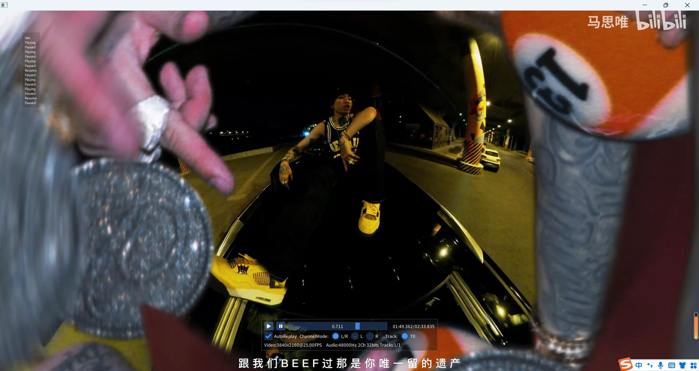

# SDMP (script definable multimedia pipeline)
- SDMP是一个使用脚本定义多媒体业务流的轻量级媒体框架，通过组织各个Filter，完成音视频的各种功能，如播放器，转码器，关键帧提取打包，音视频推流等。
- SDMP设计上类似DirectShow和GStreamer，特别借鉴了COM组件的方式来管理资源，但轻量得多。
- SDMP的设计是作为音视频开发包来嵌入各个应用场景，各位可以实现自己的Filter，并搭建Graph来实现自己的业务。
- SDMP的目标系统是Windows，Linux， macOS，iOS，Android，*BSD。作为嵌入SDK来辅助APP需求，如开发自己的播放器，视频裁剪器等，实际上SDMP也作为短视频SDK项目Brilliant的核心音视频库存在。对于终端用户，也同时提供了封装好的播放器等开箱即用组件。
- SDMP非常关注嵌入式Linux领域，在力所能及的条件下，会适配各种芯片以及其固件等。（实际上，该项目最早运行在Rockchip 3399芯片上，ARM Linux Buildroot，使用RKMPP硬解码，并通过DrmPlane直显示到屏幕，QT界面在另一个上层DrmPlane）
- SDMP使用LUA来搭建Graph业务流和逻辑，宿主使用C++来嵌入上下文。
- SDMP内部包含TextureIO库，来完成视频视频帧到GPU的上传，并提供Shader来直接渲染出画面(你也可以经由获取参考shader，使用宿主自己的图形管线来渲染，也可以绑定一个FrameBuffer，将视频直接渲染到你宿主的纹理)，更多信息请参考https://github.com/MountainRipper/textureio.git 

## 注意：
编译需要三方依赖库，请clone https://github.com/MountainRipper/third_party.git 到同级目录，并运行build.sh进行编译(linux),windows先运行build.bat,这将会首先安装msys2环境并启动，此时项目被挂载到/MountainRipper/third_party，进入该目录运行build.sh即可(会自动安装编译器和所需工具)

## 预备知识
需要基础的C++ 11知识以载入和运行脚本，基本LUA知识以编写业务脚本（SDMP并没有重度使用LUA），额外的SOL2库使用经验以更好进行二次开发。 



##如何使用
C++端启动一个引擎
```cpp
int32_t SdmpExample::init(){
    std::string base_scipts_dir = "where you deploy you script";
    //初始化sdmp，这会在内部枚举资源，初始化Filter仓库等。
    sdmp::Factory::initialize_factory();
    //外部特性信息，比如linux是运行于GLX还是EGL等。一般使用不用太关注
    sdmp::FeatureMap features;
    //engine.lua包含了音频设备信息，如后端是alsa还是winmm，输出采样率，设备关键字等
    sdmp::Factory::initialnize_engine(base_scipts_dir,(std::filesystem::path(base_scipts_dir)/"engine.lua").string(),features);

    //使用player.lua创建一个Graph，其中包含了一个播放器逻辑
    auto graph = sdmp::Factory::create_graph_from(std::filesystem::path(base_scipts_dir)/"player.lua",
        [this](sdmp::IGraph* graph,GraphEventType event,int32_t param){
                //获取脚本加载状态
                if(event == kGraphEventLoaded){
                    //脚本加载完毕，向脚本注入你关心的C++函数和对象
                    sol::state& state = *graph->vm();
                    state["luaCallNative"] = &SdmpExample::lua_call_native;
                    state["luaCallNativeMultiParam"] = &SdmpExample::lua_call_native_multi_param;
                    state["nativeContext"] = this;
                    return 0;
                }
                else if(event == kGraphEventCreated){
                    //脚本加载完成后，会按照脚本内容创建Filter组件，此时我们可以获取并操作Filter，这里我们在Graph中插入了一个视频输出接收器，用于渲染视频（sdmp::GraphHelper::append_video_observer是辅助方法，内部查询了视频输出Filter，并设置观察者接口，同时返回了绑定的render，可用于后续操作）
                    ComPointer<IFilterExtentionVideoOutputProxy> render;
                    sdmp::GraphHelper::append_video_observer(graph,"",static_cast<IFilterExtentionVideoOutputProxy::Observer*>(this),true,render);
                    //执行Graph Filter连接命令，sdmp会调用脚本的连接逻辑，然后判断该Graph是否逻辑可用（即有可用的Filter树）
                    graph->execute_command(kGraphCommandConnect);
                    //执行Graph运行命令，开始驱动数据流
                    graph->execute_command(kGraphCommandPlay);
                    return 0;
                }
                else if(event == kGraphEventError){
                    fprintf(stderr,"load graph error:%d\n",param);
                }
                else if(event == kGraphEventMasterLoop){
                    //master loop do what you want
                }
                return 0;
            });

    //Graph有自己的master线程，在该线程之外，可以使用execute_command_async进行异步调用，命令将进入执行队列，在master线程中执行
    graph->execute_command_async(kGraphCommandStop);
    //可以异步调用lua中的方法(kGraphCommandCallLuaFunction命令)，这里调用了lua方法nativeSetVolume，将音量设置到100%
    //格式为 Arguments("lua_function_name").add(param1).add(param2).add(param3)
    //参数可以为数字类型，std::string，char*，bool，void*，std::vector<double>，std::vector<std::string>,详见mr::sdmp::Value
    graph->execute_command_async(kGraphCommandCallLuaFunction,Arguments("nativeSetVolume").add(1.0));

}

//lua调用至c++的方法
void SdmpExample::lua_call_native(const std::string& call_id,const std::string& param){
    fprintf(stderr,"get a call from script:%s param:%s\n",call_id.c_str(),param.c_str());
}
//你也可以注册一个可变参数的方法（sol2库）
void SdmpExample::lua_call_native_multi_param(const std::string& call_id,sol::variadic_args args params){
    for (auto v : params) {
        //根据类型获取值
        auto value_type = v.value().get_type();
        switch (value_type) {
            case sol::type::number:any_value = value.as<double>();break;
            case sol::type::string:any_value = value.as<std::string>();break;
            case sol::type::boolean:any_value = value.as<bool>();break;
            ...
        }
        //或者更简单的赋值给sdmp::Value,注意，请使用指针赋值，为了保持sdmp的api尽量干净少依赖，sol2的类型只有前向声明，所以这里需要指针
        Value value(&v);
        fprintf("value is :%s",StringUtils::printable(value));
    }
}

```

engine.lua的定义
```lua
-- 引擎是全局的，Graph可以有多个实例，但Engine只有一个，其中包含的都是共享资源，如需要音频输出，必须定义一个audioOutputs，里面包含需要开启的媒体设备，在这里我们定义了一个名为两个音频设备，其名称用于Graph中，为音频输出Filter指定使用哪个输出设备，作为音频引擎，多路混音便在其中实现

--
audioOutputs={
	defaultAudioPlaybackDevice={ -- 一个名为defaultAudioPlaybackDevice的设备
		module='miniaudioOutput',-- 使用miniaudioOutput模块，这是sdmp内置的模块，你可以自己实现一个进行注册
		selector='Realtek', -- 设备关键字为Realtek
		backend='alsa', -- 使用alsa后端进行播放
		samplerate=48000, --采样率
		channels=2, -- 声道
		framesize=480, -- 每次请求数据的粒度，这里即为10ms
		bits=32, -- 位深度，这里为32位FLOAT (miniaudioOutput模块 中 16=short 32=float)
	}，
    outdoorAudioPlaybackDevice={ -- 第二个输出设备，字段同上
		module='miniaudioOutput', 
		selector='HDMI',
		backend='pulse',
		samplerate=44100,
		channels=6, -- 5.1声道
		framesize=882, -- 20ms
		bits=16, -- short sample
	}
}	
```

player.lua的部分关键代码
```lua
-- graph 是一个具体的业务逻辑，可以实现为播放器，也可以实现为转码器，

graphModule = require('graph') --载入graph基类，graph包含了和C++端调用的基础逻辑，事件通知等
oo.class("Player", Graph) --派生出一个Player

function mediaSoueceException(objectId,code)
	-- 处理资源加载错误
end

function Player:init()
	Player.super.init(self)

    -- self.filters 是初始化Filter列表，Graph加载的时候，会被默认创建，
	self.filters={
		mediaSource={ --模块名，即脚本中的实例名，元表中为模块的初始属性，不同模块有不同的属性，其中module是必须的
			module='mediaSourceFFmpeg', --模块ID属性是必须的，指定了以哪个模块创建对象，这是注册到sdmp组件仓库中的Filter名
			exceptionHandler=mediaSoueceException, -- 加载异常的捕获函数
            uri='http://vfx.mtime.cn/Video/2021/07/10/mp4/210710171112971120.mp4' --初始uri，可以是本地文件，也可以是网络文件或流（视ffmpeg的编译参数）
		},	

		videoDecoder={
			module='videoDecoderFFmpeg', -- 内置ffmpeg视频解码器
			-- module='videoDecoderRkmpp', -- 内置瑞芯微的rkmpp硬件解码器，在arm linux上使用的，这里演示如何使用不同的解码器，改模块id即可
			hardwareApi="auto" -- ffmpeg有硬件解码功能 空为不使用，auto为自动，其余包含vaapi，dxva等，（视ffmpeg的编译参数）
		},
        audioDecoder={
			module='audioDecoderFFmpeg' -- 内置ffmpeg 音频解码器
		},
		videoOutput={
			module='videoOutputProxy', -- 视频输出代理，sdmp不直接输出视频，这是用户去实现的，视用户如何整合进宿主，这涉及到外部的业务逻辑，当然sdmp包含的textureio库，能替你渲染，不过也需要接入外部的缓存/渲染流程
			modePullPush=false
		},
        audioOutput={
            module='audioOutputParticipant', -- 音频输出Participant，这里叫参与者而不叫设备，是因为设备是共享的，这份音频只是其中一路混音流
            idEngine='defaultAudioPlaybackDevice', -- 使用哪一个音频设备，即在engine.lua中定义的音频设备id
            cacheDuration=1500, -- 缓冲区大小，单位为ms，模块会在饥饿时拉取1500ms的缓冲区
            cacheHungerDuration=500, -- 饥饿阈值，当缓冲区小于500ms时，开始拉取补充数据至1500ms
            volume=0.5 -- 初始音量大小
        }
	}
	
end

--filter 连接事件 由C++中graph->execute_command(kGraphCommandConnect);触发
function Player:onConnectEvent()
    self:connectAuto(mediaSource,videoDecoder) -- 连接媒体源和视频解码器
	self:connectAuto(videoDecoder,videoOutput) -- 连接视频解码器和视频输出代理

    self:connectAuto(mediaSource,audioDecoder) -- 连接媒体源和音频解码器
    self:connectAuto(audioDecoder,audioOutput) -- 连接音频解码器和音频设备输出流

    --你可以动态创建filter并连接，比如有些媒体文件有多路音频流，如电影有中文音频和英文音频，那此时可以再创建Filter进行动态连接
    --作为演示，这里不关心上面其实已经连接了一个pin，此处会又连接一个输出，实际使用会再做判断或者全部动态连接
    --可以参考sdmp/easy/script-easy/player.lua的实现
    self.tracks = 1
    for i = 1, #mediaSource.pinsOutput do --枚举媒体源上的输出pin
		if(mediaSource.pinsOutput[i].type == "audio") then
			self.tracks = self.tracks + 1
            
            --使用self:createFilter 进行动态创建，包含filter名和属性列表，同Player:init()中的含义
			local audioDecoder = self:createFilter('audioDecoder'....tostring(self.tracks), params={module='audioDecoderFFmpeg'})
			local audioOutput = self:createFilter('audioOutput'..tostring(self.tracks), 
                                                params={module='audioOutputParticipant',
                                                idEngine='defaultAudioPlaybackDevice',
                                                cacheDuration=1500,
                                                cacheHungerDuration=500,
                                                volume=0})

            -- 连接动态创建的Filter
            self:connectAuto(mediaSource, audioDecoder)
			self:connectAuto(audioDecoder, audioOutput)
		end
	end

    --调用C++注入的方法luaCallNative，nativeContext是SdmpExample对象实例this指针，后面为参数
    luaCallNative(nativeContext,"connect-done", "no-error")
    --调用C++多参数方法
    luaCallNativeMultiParam(nativeContext,"A", false, 3.1415926, {a=1,b="BBB"})
end
```

下面演示如何创建一个转码器，并将视频调整到1280x720,如果输入尺寸不是16:9，则包围黑边
```lua
graphModule = require('graph')
oo.class("Transcoder", Graph)
function Transcoder:init()
    self.filters={
        mediaSource={ 
			module='mediaSourceFFmpeg', 
			exceptionHandler=mediaSoueceException, 
            uri='http://vfx.mtime.cn/Video/2021/07/10/mp4/210710171112971120.mp4'
		},	

		videoDecoder={
			module='videoDecoderFFmpeg', 
			hardwareApi="" -- 不使用硬解码， 因为需要帧缩放和转码，编码器只支持内存视频帧
		},
        audioDecoder={
			module='audioDecoderFFmpeg'
		},
        videoConverter={
			module='videoFrameConvert', -- 视频帧转换模块
			width=1280, --输出宽度
			height=720, --输出高度
			format="i420",--输出格式
			fillMode="fit"--输出填充模式，AspectFit，保持输出画面比例不变，长边空余部分清空(黑色)
		},
        videoEncoder={
			module='videoEncoderFFmpeg', 
            bitrate=2048000, -- bitrate 2Mbps
            encoderName='libx264', -- ffmpeg encoder named
            keyframeInterval=30, --关键帧间隔
            preset='fast' -- x264预设参数集
		},
        audioEncoder={
            module='audioEncoderFFmpeg', 
            bitrate=128000, 
            encoderName='aac'
        },
        mediaFileMuxer={
            module='mediaMuxerFFmpeg', 
            uri='d:\\resource\\encoded.mp4',
            --uri='rtmp://some-rtmp-server.com/path/to/you/push/address',
        }
    }
end

function Transcoder:onConnectEvent()
    self:connectAuto(mediaSource,videoDecoder)  --连接媒体源和解码器
	self:connectAuto(videoDecoder,videoConverter) --连接解码器和帧转换器
    self:connectAuto(videoConverter,videoEncoder) --连接转换器和编码器
    self:connectAuto(videoEncoder,mediaFileMuxer) --连接视频编码器和文件输出器

    self:connectAuto(mediaSource,audioDecoder)  --连接媒体源和音频解码器
    self:connectAuto(audioDecoder,audioEncoder) --连接音频解码器和音频编码器进行转码
    self:connectAuto(audioEncoder,mediaFileMuxer) --连接音频编码器和文件输出器
end
```